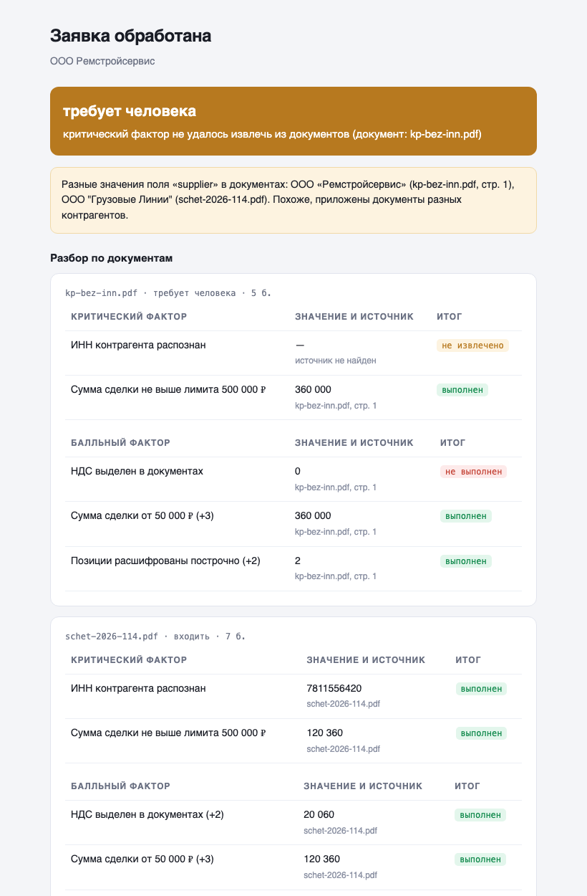
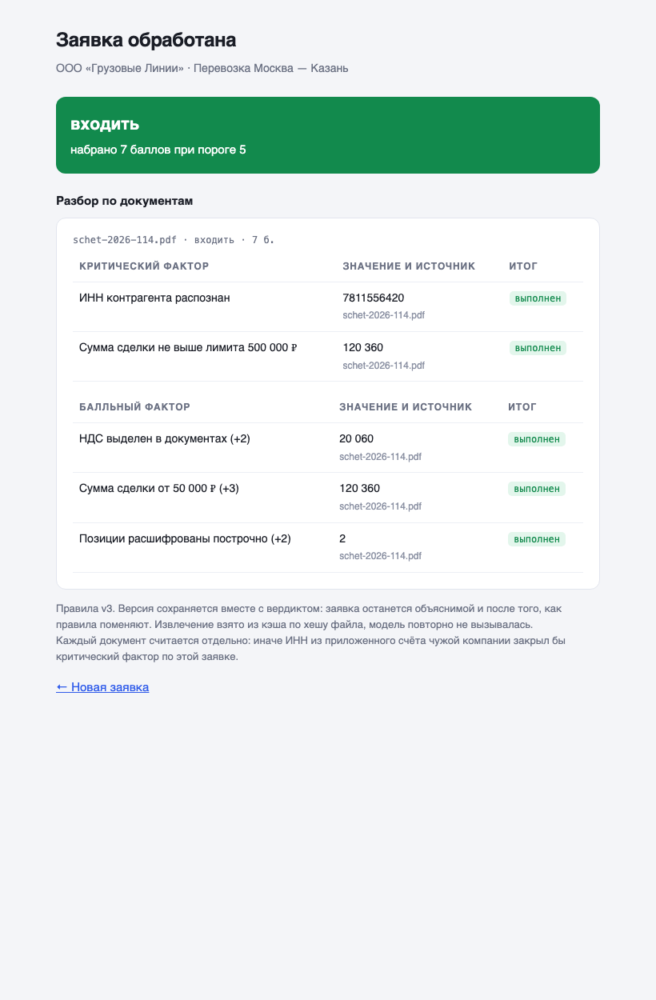

# Конвейер обработки заявок: документы → вердикт

**Задача.** В компанию приходят заявки на сделки с пачкой документов. Кто-то вручную
вычитывает реквизиты и суммы, сверяет с внутренними критериями и решает, входить
в сделку или нет. Это медленно, и решения зависят от того, кто смотрел.

**Что сделано.** Конвейер: приём заявки с документами → извлечение полей через ИИ →
предквалификация по настраиваемым правилам → вердикт с разбором по каждому фактору.
Правила лежат в `rules.json` и меняются без правки кода.

## Три решения, ради которых демо и собрано

### Документы не сливаются в общий профиль

К заявке приложены два документа: коммерческое предложение без реквизитов
и счёт другой компании. Соблазнительная реализация — слить поля из всех файлов
в один профиль. Тогда ИНН из чужого счёта закрыл бы критический фактор,
и заявка получила бы «входить».

Здесь каждый документ считается отдельно, итог по заявке — самый строгий
из вердиктов. Плюс конвейер замечает, что поставщики в документах разные,
и говорит об этом прямо.

### Три исхода вместо двух

У фактора два разных провала: «не соответствует критерию» и «не смогли извлечь».
Если схлопнуть их в один, заявка с плохо распознанным сканом наберёт проходной балл
и уедет в сделку. Система начнёт пропускать ровно те заявки, документы по которым
читались хуже всего.

На скриншоте видно: КП набрало 5 баллов при пороге 5 — то есть проходной балл, —
но ушло к человеку, потому что ИНН не извлёкся. Пустая строка от модели считается
так же, как отсутствие значения, и значение неожиданного типа тоже: любая неясность
уводит к человеку, а не в автоматический отказ.

### Вердикт хранит версию правил

Внизу каждого вердикта — версия набора правил, по которому его посчитали.
Правила меняются, и без версии заявка от марта через полгода пересчитается
по июльским правилам: объяснить контрагенту отказ станет нечем.

Каждое значение тащит источник — файл и страницу. Разбор, который показывает
«сумма 360 000 → +3 балла» и не показывает, откуда взялась сумма, при первом же
споре превращается в ручную перепроверку всего пакета.

## Повтор не меняет вердикт

Извлечение кэшируется по хешу файла: повторная отправка того же документа берёт
сохранённый разбор и не зовёт модель заново. Без этого ретрай после таймаута вернул бы
другие числа, и одна заявка получила бы разные вердикты — со стороны это читается
как «система сама меняет решения».

## Как проверялось

Демо прошло адверсариальную ревизию: три независимых ревьюера искали дефекты,
каждую находку проверяли два скептика, пытаясь опровергнуть. Нашли и починили,
в частности: слияние документов, которое обходило защиту выше; запись файла
по клиентскому имени (`../../rules.json` перезаписывал правила); падение с 500
на не-PDF и пустом файле; строковые числа от модели, роняющие движок; суммы,
показанные как `360000.0`.

Тесты движка: `.venv/bin/python -m pytest test_engine.py` — одиннадцать проверок,
включая ту, что ИНН из чужого документа не закрывает критический фактор.

## Как запустить

    python3 -m venv .venv && .venv/bin/pip install -r ../requirements.txt
    cp ../.env.example ../.env      # вписать ключ модели
    .venv/bin/python -m uvicorn app:app --port 8300

Открыть `http://localhost:8300`, приложить PDF из `samples/`.

## Что это не

Демо ядра, а не готовая система. Нет: приёма писем, идемпотентности по внешнему
идентификатору, админки правил через интерфейс, журнала этапов с ретраями,
подключения к CRM. Читаются PDF с текстовым слоем; сканы требуют отдельного
OCR-слоя. Всё это — объём полноценного проекта, здесь показан принцип.

Сделано как демонстрация подхода, реального клиента за этим кейсом нет.
