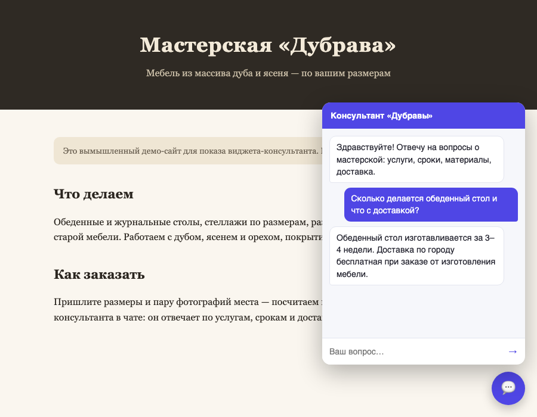

# Виджет-консультант на сайт

**Задача.** На сайт бизнеса приходят посетители с одинаковыми вопросами: сроки,
доставка, цены, часы работы. Форма обратной связи отвечает через часы,
и посетитель уходит. Нужен чат в углу страницы, который отвечает сразу
и по делу — по базе знаний бизнеса, а не фантазиями.

**Что сделано.** Виджет подключается к любому сайту одной строкой:

    

Кнопка-пузырь в углу, окно чата, история диалога. Демо собрано для вымышленной
столярной мастерской «Дубрава»: страница [`demo.html`](demo.html), база знаний
[`knowledge.md`](knowledge.md).

На скриншоте настоящий ответ модели: сроки и условия доставки взяты из базы
знаний, не выдуманы.

## Главное в этом кейсе — куда спрятан ключ

Ключ модели нельзя класть в браузерный код: его увидит любой посетитель через
«Просмотреть код» и сожжёт весь баланс за вечер. Так делают удивительно часто.

Здесь между виджетом и моделью стоит прокси — [`worker.js`](worker.js) для
Cloudflare Workers (бесплатный тариф, карты не нужно). Ключ живёт в секретах
воркера и в браузер не попадает никогда. Проверяется одной командой:

    grep -r "AI_API_KEY\|sk-" widget.js demo.html   # пусто

Прокси заодно держит оборону:

- роли сообщений из белого списка — подсунуть свою «системную роль» нельзя
  (проверено: такой запрос получает 400);
- история обрезается до 20 сообщений, каждое до 500 знаков — накрутить
  расход длинными простынями не выйдет;
- CORS ограничивается доменом сайта клиента.

## Поведение консультанта

Проверено на живой модели:

| Вопрос | Ответ |
|---|---|
| «Сколько делается стол и какая предоплата?» | «Изготовление столов… 3–4 недели. Предоплата 30%» — точно по базе |
| «Напиши реферат по истории Рима» | вежливый отказ и возврат к теме мастерской |
| Запрос с чужой системной ролью | 400, до модели не доходит |

## Как запустить локально

    python3 proxy_local.py        # локальный эквивалент воркера, ключ из ../.env
    python3 -m http.server 8130   # отдать demo.html
    открыть http://localhost:8130/demo.html

`proxy_local.py` повторяет контракт `worker.js` один в один — так виджет
проверяется целиком до деплоя. Публикация на Cloudflare — по инструкции
в шапке `worker.js`, через веб-интерфейс, без командной строки.

## Ограничения, о которых честно говорю заказчику

- Консультант отвечает по базе знаний; чего в ней нет — честно отправляет
  в форму на сайте. Базу наполняет заказчик, я помогаю структурировать.
- Каждый ответ стоит долю копейки на балансе модели — при всплеске трафика
  расход виден в кабинете прокси-сервиса.

Сделано как демонстрация подхода, реального клиента за этим кейсом нет.
